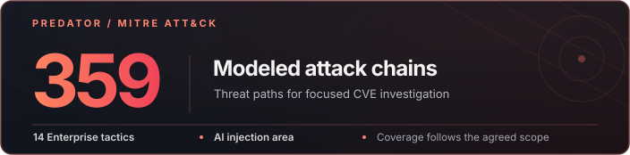

  

<h1 align="center">
  
  &nbsp;I’m Brandon&nbsp;
  
</h1>

  <strong>Founder of Aether AI</strong> 
  AI  ·  Cybersecurity  ·  Open Source   ·   Trading & Developer Tools

  
  

  
  

<table align="center">
  <thead>
    <tr>
      <th align="left" scope="col">Focus</th>
      <th align="left" scope="col">Explore</th>
    </tr>
  </thead>
  <tbody>
    <tr>
      <td><strong>AI &amp; developer tools</strong></td>
      <td><a href="https://github.com/AetherAI3/aether-agent">Agent</a> · <a href="https://github.com/AetherAI3/Cloud-Desktop">Cloud</a> · <a href="https://github.com/AetherAI3/Unlimited-Context-LLM">Unlimited Context</a></td>
    </tr>
    <tr>
      <td><strong>Security &amp; research</strong></td>
      <td><a href="https://github.com/AetherAI3/predator-cli">Predator</a> · <a href="https://github.com/AetherAI3/PROTOCOL-C">Protocol-C</a></td>
    </tr>
    <tr>
      <td><strong>Websites</strong></td>
      <td><a href="https://aethersites.net/">Aether Sites</a></td>
    </tr>
  </tbody>
</table>

  
  
  
  
  

<h2 align="center">Predator Strikes</h2>

  

  Fix a known CVE or search for a fresh variant in one authorized repo. 
  <a href="https://aethersystems.net/strikes/#cve-fix">Known CVE Fix · $199</a> &nbsp;·&nbsp;
  <a href="https://aethersystems.net/strikes/#discovery">Predator Discovery · $299</a> &nbsp;·&nbsp;
  <a href="https://aethersystems.net/strikes/#deep-discovery">Deep Discovery · $499</a>

   
  Scope before payment · no guaranteed finding · patch when feasible. 
  <a href="https://github.com/AetherAI3/Predator#read-the-evidence">Public Predator evidence</a>
  (controlled-fault research, not customer CVEs)

  <a href="https://aethersystems.net/actions/design-partner">Predator CI</a> · $39/month per qualified repo + hosted UVT · private preview 

<h2 align="center">Support the open source</h2>

  If a project helps you, a star, bug report, or contribution means a lot.

  

